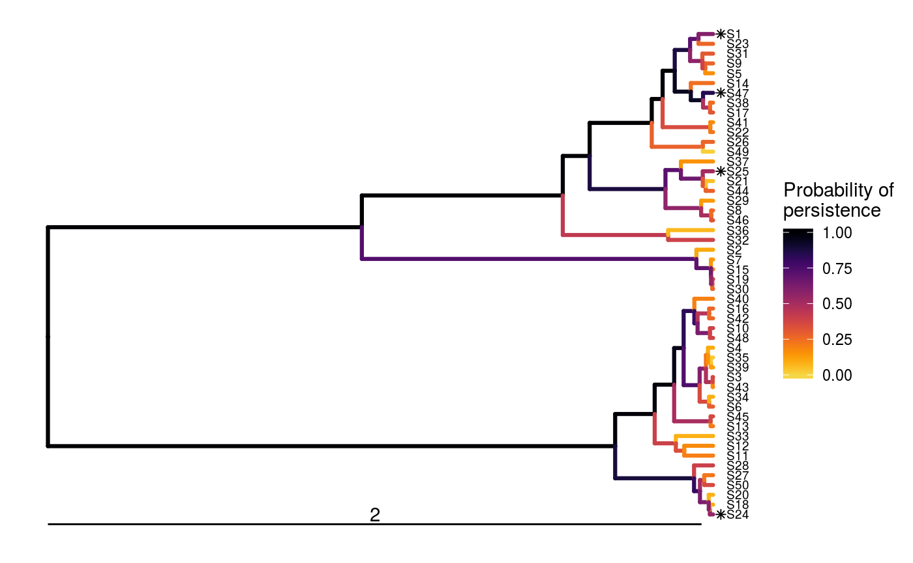
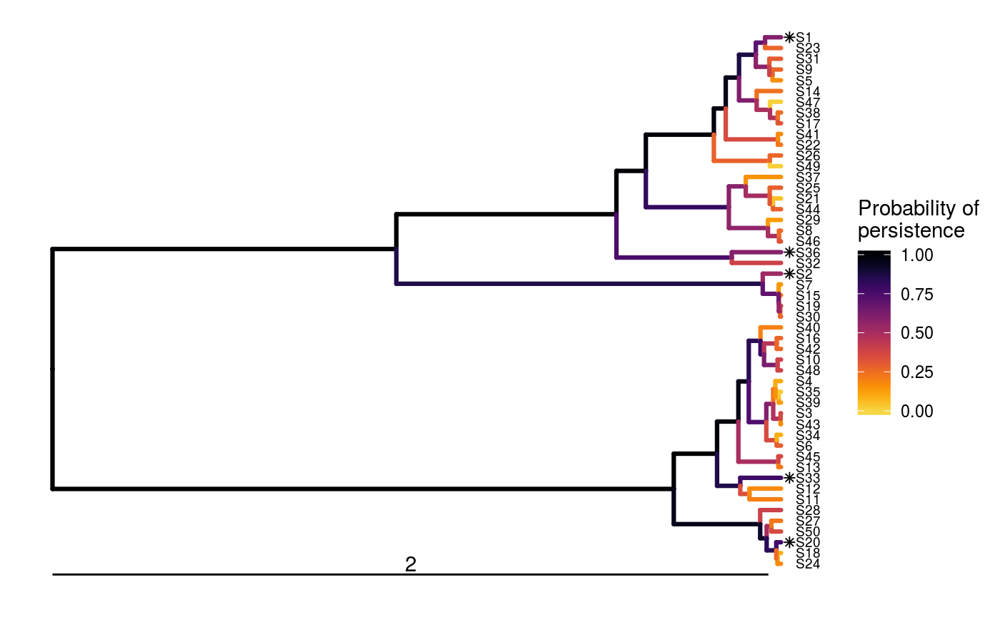

<!--- README.md is generated from README.Rmd. Please edit that file -->
Optimal Project Prioritization Protocol
=======================================

[](https://www.tidyverse.org/lifecycle/#experimental) [](https://travis-ci.org/prioritizr/optimalppp) [](https://ci.appveyor.com/project/jeffreyhanson/optimalppp) [](https://codecov.io/github/prioritizr/optimalppp?branch=master) [](https://CRAN.R-project.org/package=optimalppp)

**This repository is still under active development. It is not yet ready for use.**

The *optimalppp R* package provides methods for prioritizing funding of conservation projects using the 'Protect Prioritization Protocol'. A range of methods are provided for identifying priority projects for funding. These include exact algorithm solvers which can identify optimal solutions, and also stingy heuristic algorithms that have conventionally been used to identify suboptimal solutions. This package also provides the functionality to visualize how well solutions maintain biodiversity.

Installation
------------

The latest development version can be installed using the following code.

``` r
if (!require(devtools))
  install.packages("devtools")
devtools::install_github("prioritizr/optimalppp")
```

Usage
-----

Here we will provide a short example showing how the *optimalppp R* package can be used to prioritize funding for conservation projects. To start off, we will set the seed for the random number generator to ensure you get the same results as shown here, set some default behavior for the *R* session, load the *optimalppp R* package, and load the *ggtree R* package to plot phylogenetic trees. Please note that you will need install the *ggtree* and *treeio* package separately from Bioconductor since they are not on the Comprehensive R Archive Network (CRAN; see the `ppp_plot` help file for [installation instructions](https://prioritizr.github.io/optimalppp/reference/ppp_plot.html)).

``` r
set.seed(500)
options(getClass.msg = FALSE)
library(optimalppp)
library(ggtree)
```

Now we will load some data sets that are distributed with the package. First, we will load the `sim_tree` object. This object describes the evolutionary relationships between 50 simulated species (named S1, S2, S3, ...). The length of each phylogenetic branch corresponds to millions of years of evolutionary history, and the last common ancestor for all these species occurred approximately 2 million years ago.

``` r
# load data
data(sim_tree)

# plot tree
ggtree(sim_tree) +
geom_tiplab(size = 2.5) +
geom_treescale(width = 2, x = 0, offset = 1)
```

    ## Found more than one class "phylo" in cache; using the first, from namespace 'tidytree'

    ## Also defined by 'treeio'

    ## Found more than one class "phylo" in cache; using the first, from namespace 'tidytree'

    ## Also defined by 'treeio'


Next, we will load the `sim_project_data` object. This object stores information about various conservation projects in a tabular format (i.e. `tibble`). Each row corresponds to a different project, and each column describes various properties associated with the projects. Importantly, the `"name"` column contains the name of each project, the `"cost"` column contains the cost of each project, the `"success"` column denotes the probability of each project succeeding if it is funded, and the `"S1"`--`"SN"` columns show the enhanced probability of each species persisting if the project is funded. It also contains additional columns, but we will ignore them for now. Note that the last project---the `"baseline_project"`---has a zero cost and represents the baseline probability of each species persisting if no other project is funded. Finally, though most projects in this example directly relate to a single species, you can input projects that directly affect the persistence of multiple species.

``` r
# load data
data(sim_project_data)

# print table
print(sim_project_data)
```

    ## # A tibble: 51 x 55
    ##    name   cost success locked_in locked_out    S1   S10   S11   S12   S13
    ##    <chr> <dbl>   <dbl> <lgl>     <lgl>      <dbl> <dbl> <dbl> <dbl> <dbl>
    NA
    NA
    NA
    NA
    NA
    NA
    NA
    NA
    NA
    NA
    ## # ... with 41 more rows, and 45 more variables: S14 <dbl>, S15 <dbl>,
    ## #   S16 <dbl>, S17 <dbl>, S18 <dbl>, S19 <dbl>, S2 <dbl>, S20 <dbl>,
    ## #   S21 <dbl>, S22 <dbl>, S23 <dbl>, S24 <dbl>, S25 <dbl>, S26 <dbl>,
    ## #   S27 <dbl>, S28 <dbl>, S29 <dbl>, S3 <dbl>, S30 <dbl>, S31 <dbl>,
    ## #   S32 <dbl>, S33 <dbl>, S34 <dbl>, S35 <dbl>, S36 <dbl>, S37 <dbl>,
    ## #   S38 <dbl>, S39 <dbl>, S4 <dbl>, S40 <dbl>, S41 <dbl>, S42 <dbl>,
    ## #   S43 <dbl>, S44 <dbl>, S45 <dbl>, S46 <dbl>, S47 <dbl>, S48 <dbl>,
    ## #   S49 <dbl>, S5 <dbl>, S50 <dbl>, S6 <dbl>, S7 <dbl>, S8 <dbl>, S9 <dbl>

Let us assume that our resources are limited such that we can only spend, at most, $500 on funding conservation projects. In other words, our budget is capped at $500. Now, given the project data (`sim_project_data`), the species' evolutionary relationships (`sim_tree`), and this budget (`500`), we can begin prioritizing funding for the conservation projects. Conventionally, conservation projects have been prioritized using stingy heuristic algorithms (e.g. Bennett *et al.* 2014), so let's generate our first prioritization using this method.

``` r
# prioritize funding using stingy heuristic algorithm
s1 <- ppp_heuristic_solution(x = sim_project_data, tree = sim_tree,
                             budget = 500, project_column_name = "name",
                             cost_column_name = "cost",
                             success_column_name = "success")

# print output
print(s1)
```

    ## # A tibble: 1 x 57
    ##   solution objective budget  cost optimal method S1_project S2_project
    ##      <int>     <dbl>  <dbl> <dbl> <lgl>   <chr>  <lgl>      <lgl>     
    NA
    ## # ... with 49 more variables: S3_project <lgl>, S4_project <lgl>,
    ## #   S5_project <lgl>, S6_project <lgl>, S7_project <lgl>,
    ## #   S8_project <lgl>, S9_project <lgl>, S10_project <lgl>,
    ## #   S11_project <lgl>, S12_project <lgl>, S13_project <lgl>,
    ## #   S14_project <lgl>, S15_project <lgl>, S16_project <lgl>,
    ## #   S17_project <lgl>, S18_project <lgl>, S19_project <lgl>,
    ## #   S20_project <lgl>, S21_project <lgl>, S22_project <lgl>,
    ## #   S23_project <lgl>, S24_project <lgl>, S25_project <lgl>,
    ## #   S26_project <lgl>, S27_project <lgl>, S28_project <lgl>,
    ## #   S29_project <lgl>, S30_project <lgl>, S31_project <lgl>,
    ## #   S32_project <lgl>, S33_project <lgl>, S34_project <lgl>,
    ## #   S35_project <lgl>, S36_project <lgl>, S37_project <lgl>,
    ## #   S38_project <lgl>, S39_project <lgl>, S40_project <lgl>,
    ## #   S41_project <lgl>, S42_project <lgl>, S43_project <lgl>,
    ## #   S44_project <lgl>, S45_project <lgl>, S46_project <lgl>,
    ## #   S47_project <lgl>, S48_project <lgl>, S49_project <lgl>,
    ## #   S50_project <lgl>, baseline_project <lgl>

The object `s1` contains the solution and also various statistics associated with the solution in a tabular format (i.e. `tibble`). Here, each row corresponds to a different solution. Specifically, the `"solution"` column contains an identifier for the solution (this is useful for methods that output multiple solutions), the `"objective"` column contains the objective value (i.e. the expected phylogenetic diversity, Faith 2008), the `"budget"` column stores the budget used for generating the solution, the `"cost"` column stores the cost of the solution, the `"optimal"` column indicates if the solution is known to be optimal (`NA` values mean the optimality is unknown), and the `"method"` column contains the name of the method used to generate the solution. The remaining columns (`"S1_project"`, `"S2_project"`, `"S3_project"`, `"S4_project"`, `"S5_project"`, and `"baseline_project"`) indicate if a given project was prioritized for funding in the solution or not.

Here, the objective value (in the `"objective"` column) denotes the amount of evolutionary history that is expected to persist (i.e. 6.629 million years). Put simply, solutions that are expected to result in better conservation outcomes will be associated with a greater objective value. Since tabular data can be difficult to intuit, let's visualize how well this solution would maintain the different branches in the phylogeny. Note that species which receive any funding are denoted with an asterisk.

``` r
# visualize solution
ppp_plot(sim_project_data, sim_tree, s1, project_column_name = "name",
         cost_column_name = "cost", success_column_name = "success")
```

    ## Found more than one class "treedata" in cache; using the first, from namespace 'tidytree'

    ## Also defined by 'treeio'


In some cases, there may exist iconic species that are socially and economically important for conservation. To ensure that projects which benefit such species are funded, we can "lock in" certain projects into the solution (conversely, we can also "lock out" certain projects if desired). Let us imagine that it is absolutely critical that the project for species S1 (named `"S1_project"`) receive funding. We can then generate another solution using the stingy heuristic algorithm with this constraint.

``` r
# set locked in column to only lock in species S3
sim_project_data$locked_in <- sim_project_data$name == "S1_project"

# prioritize funding using stingy heuristic algorithm
s2 <- ppp_heuristic_solution(x = sim_project_data, tree = sim_tree,
                             budget = 500, project_column_name = "name",
                             cost_column_name = "cost",
                             success_column_name = "success",
                             locked_in_column_name = "locked_in")

# print output
print(s2)
```

    ## # A tibble: 1 x 57
    ##   solution objective budget  cost optimal method S1_project S2_project
    ##      <int>     <dbl>  <dbl> <dbl> <lgl>   <chr>  <lgl>      <lgl>     
    NA
    ## # ... with 49 more variables: S3_project <lgl>, S4_project <lgl>,
    ## #   S5_project <lgl>, S6_project <lgl>, S7_project <lgl>,
    ## #   S8_project <lgl>, S9_project <lgl>, S10_project <lgl>,
    ## #   S11_project <lgl>, S12_project <lgl>, S13_project <lgl>,
    ## #   S14_project <lgl>, S15_project <lgl>, S16_project <lgl>,
    ## #   S17_project <lgl>, S18_project <lgl>, S19_project <lgl>,
    ## #   S20_project <lgl>, S21_project <lgl>, S22_project <lgl>,
    ## #   S23_project <lgl>, S24_project <lgl>, S25_project <lgl>,
    ## #   S26_project <lgl>, S27_project <lgl>, S28_project <lgl>,
    ## #   S29_project <lgl>, S30_project <lgl>, S31_project <lgl>,
    ## #   S32_project <lgl>, S33_project <lgl>, S34_project <lgl>,
    ## #   S35_project <lgl>, S36_project <lgl>, S37_project <lgl>,
    ## #   S38_project <lgl>, S39_project <lgl>, S40_project <lgl>,
    ## #   S41_project <lgl>, S42_project <lgl>, S43_project <lgl>,
    ## #   S44_project <lgl>, S45_project <lgl>, S46_project <lgl>,
    ## #   S47_project <lgl>, S48_project <lgl>, S49_project <lgl>,
    ## #   S50_project <lgl>, baseline_project <lgl>

``` r
# visualize solution
ppp_plot(sim_project_data, sim_tree, s2, project_column_name = "name",
         cost_column_name = "cost", success_column_name = "success") +
geom_treescale(width = 2, x = 0, offset = 1)
```


Next, we might want to evaluate how well this solution compares to selecting projects at random. To achieve this, we need to generate solutions that contain randomly selected projects that (i) always include the baseline scenario project, and (ii) meet the budget. Fortunately, the `ppp_random_solution` function does this for us. So, let's generate 500 random solutions with a budget of $500.

``` r
# prioritize funding using stingy heuristic algorithm
s3 <- ppp_random_solution(x = sim_project_data, tree = sim_tree,
                          budget = 500, project_column_name = "name",
                          cost_column_name = "cost",
                          success_column_name = "success",
                          locked_in_column_name = "locked_in",
                          number_solutions = 500)

# print output
print(s3)
```

    ## # A tibble: 500 x 57
    ##    solution objective budget  cost optimal method S1_project S2_project
    ##       <int>     <dbl>  <dbl> <dbl> <lgl>   <chr>  <lgl>      <lgl>     
    ##  1        1      6.24    500  496. NA      random TRUE       FALSE     
    ##  2        2      6.26    500  411. NA      random TRUE       FALSE     
    ##  3        3      6.32    500  493. NA      random TRUE       FALSE     
    ##  4        4      6.53    500  495. NA      random TRUE       FALSE     
    ##  5        5      6.27    500  490. NA      random TRUE       FALSE     
    ##  6        6      6.27    500  489. NA      random TRUE       FALSE     
    ##  7        7      6.22    500  403. NA      random TRUE       FALSE     
    ##  8        8      6.28    500  500. NA      random TRUE       FALSE     
    ##  9        9      6.27    500  402. NA      random TRUE       FALSE     
    ## 10       10      6.28    500  494. NA      random TRUE       FALSE     
    ## # ... with 490 more rows, and 49 more variables: S3_project <lgl>,
    ## #   S4_project <lgl>, S5_project <lgl>, S6_project <lgl>,
    ## #   S7_project <lgl>, S8_project <lgl>, S9_project <lgl>,
    ## #   S10_project <lgl>, S11_project <lgl>, S12_project <lgl>,
    ## #   S13_project <lgl>, S14_project <lgl>, S15_project <lgl>,
    ## #   S16_project <lgl>, S17_project <lgl>, S18_project <lgl>,
    ## #   S19_project <lgl>, S20_project <lgl>, S21_project <lgl>,
    ## #   S22_project <lgl>, S23_project <lgl>, S24_project <lgl>,
    ## #   S25_project <lgl>, S26_project <lgl>, S27_project <lgl>,
    ## #   S28_project <lgl>, S29_project <lgl>, S30_project <lgl>,
    ## #   S31_project <lgl>, S32_project <lgl>, S33_project <lgl>,
    ## #   S34_project <lgl>, S35_project <lgl>, S36_project <lgl>,
    ## #   S37_project <lgl>, S38_project <lgl>, S39_project <lgl>,
    ## #   S40_project <lgl>, S41_project <lgl>, S42_project <lgl>,
    ## #   S43_project <lgl>, S44_project <lgl>, S45_project <lgl>,
    ## #   S46_project <lgl>, S47_project <lgl>, S48_project <lgl>,
    ## #   S49_project <lgl>, S50_project <lgl>, baseline_project <lgl>

``` r
# visualize second solution
ppp_plot(sim_project_data, sim_tree, s3, project_column_name = "name",
         cost_column_name = "cost", success_column_name = "success", n = 2) +
geom_treescale(width = 2, x = 0, offset = 1)
```



We can now calculate how much better the solution generated using the stingy heuristic algorithm performs than random.

``` r
# calculate how much better solution performs than random
s2$objective - mean(s3$objective)
```

    ## [1] 0.2652586

Since the stingy heuristic algorithm performs much better than random, you might be thinking that the stingy heuristic algorithm is pretty good. But you would be wrong. This is because the heuristic algorithms provide no guarantees on solution quality relative to optimality. In other words, the objective value tells us how good the solution is, but it does not tell us how good the solution is relative to the best possible solution. Therefore we cannot possibly be confident that the solution is any good at all. Fortunately, we can use exact algorithms to find the optimal solution to this problem (for discussion on exact algorithms in conservation, see Underhill 1994; Rodrigues & Gaston 2002).

``` r
# prioritize funding using stingy heuristic algorithm
s4 <- ppp_exact_solution(x = sim_project_data, tree = sim_tree,
                         budget = 500, project_column_name = "name",
                         cost_column_name = "cost",
                         success_column_name = "success",
                         locked_in_column_name = "locked_in")

# print output - note that the optimal column is TRUE
print(s4)
```

    ## # A tibble: 1 x 57
    ##   solution objective budget  cost optimal method S1_project S2_project
    ##      <int>     <dbl>  <dbl> <dbl> <lgl>   <chr>  <lgl>      <lgl>     
    ## 1        1      6.63    500  492. TRUE    gurobi TRUE       FALSE     
    ## # ... with 49 more variables: S3_project <lgl>, S4_project <lgl>,
    ## #   S5_project <lgl>, S6_project <lgl>, S7_project <lgl>,
    ## #   S8_project <lgl>, S9_project <lgl>, S10_project <lgl>,
    ## #   S11_project <lgl>, S12_project <lgl>, S13_project <lgl>,
    ## #   S14_project <lgl>, S15_project <lgl>, S16_project <lgl>,
    ## #   S17_project <lgl>, S18_project <lgl>, S19_project <lgl>,
    ## #   S20_project <lgl>, S21_project <lgl>, S22_project <lgl>,
    ## #   S23_project <lgl>, S24_project <lgl>, S25_project <lgl>,
    ## #   S26_project <lgl>, S27_project <lgl>, S28_project <lgl>,
    ## #   S29_project <lgl>, S30_project <lgl>, S31_project <lgl>,
    ## #   S32_project <lgl>, S33_project <lgl>, S34_project <lgl>,
    ## #   S35_project <lgl>, S36_project <lgl>, S37_project <lgl>,
    ## #   S38_project <lgl>, S39_project <lgl>, S40_project <lgl>,
    ## #   S41_project <lgl>, S42_project <lgl>, S43_project <lgl>,
    ## #   S44_project <lgl>, S45_project <lgl>, S46_project <lgl>,
    ## #   S47_project <lgl>, S48_project <lgl>, S49_project <lgl>,
    ## #   S50_project <lgl>, baseline_project <lgl>

``` r
# visualize solution
ppp_plot(sim_project_data, sim_tree, s4, project_column_name = "name",
         cost_column_name = "cost", success_column_name = "success") +
geom_treescale(width = 2, x = 0, offset = 1)
```



Now that we have the optimal solution (objective value = 6.633 million years of expected evolutionary history), we can see that the solution generated by the stingy heuristic algorithm (objective value = 6.566 million years of expected evolutionary history) was indeed suboptimal. This has just been a taster of the *optimalppp R* package. For more information, please refer to the package's vignette.

Citation
--------

Please use the following citation to cite the *optimalppp R* package in publications:

Hanson JO, Schuster R, Strimas-Mackey M, Bennett J, (2018). optimalppp: Optimal Project Prioritization Protocol. R package version 0.0.0.1. Available at <https://github.com/prioritizr/optimalppp>.
