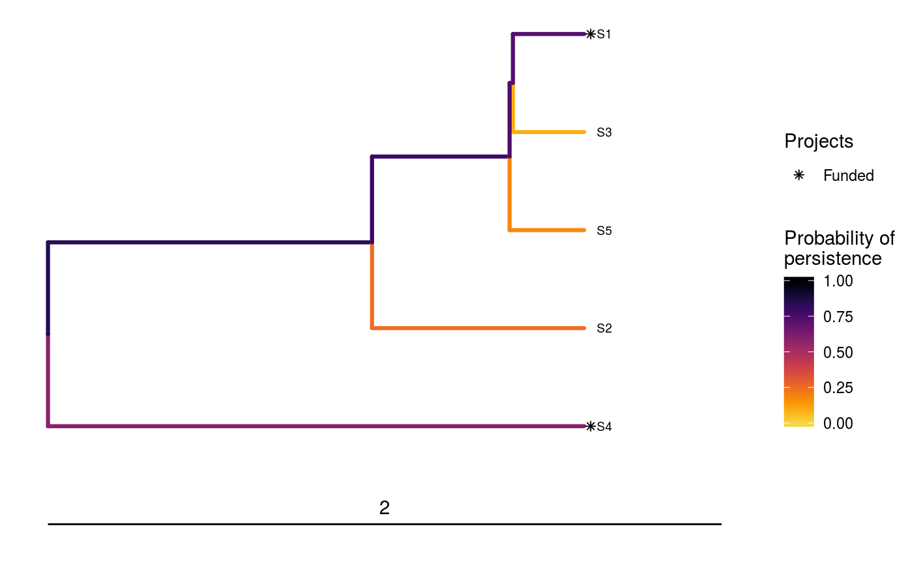

<!--- README.md is generated from README.Rmd. Please edit that file -->
Optimal Project Prioritization Protocol
=======================================

[](https://www.tidyverse.org/lifecycle/#experimental) [](https://travis-ci.org/prioritizr/optimalppp) [](https://ci.appveyor.com/project/jeffreyhanson/optimalppp) [](https://codecov.io/github/prioritizr/optimalppp?branch=master) [](https://CRAN.R-project.org/package=optimalppp)

**This package is still under development and not ready for use. Please do not use this package yet.**

The *optimalppp R* package provides methods for prioritizing funding of conservation projects using the 'Protect Prioritization Protocol'. A range of methods are provided for identifying priority projects for funding. These include exact algorithm solvers which can identify optimal solutions, and also stingy heuristic algorithms that have conventionally been used to identify solutions. This package also provides the functionality to visualize how well solutions maintain biodiversity.

Installation
------------

The latest development version can be installed using the following code. Please note that you will need install the *ggtree* package from Bioconductor since it is not available on [The Comprehensive R Archive Network](https://cran.r-project.org/).

``` r
if (!require(devtools))
  install.packages("devtools")
devtools::install_github("prioritizr/optimalppp")
if (!require(ggtree))
  devtools::install_bioc("ggtree")
```

Usage
-----

Here we will provide a short example showing how the *optimalppp R* package can be used to prioritize funding for conservation projects. To start off, we will set the seed for the random number generator to ensure you get the same results as shown here, set some default behavior for the *R* session, load the *optimalppp R* package, and load the *ggtree R* package to plot phylogenetic trees.

``` r
set.seed(500)
library(optimalppp)
library(ggtree)
```

Now we will load some data sets that are distributed with the package. First, we will load the `sim_tree` object. This object describes the evolutionary relationships between 5 simulated species (named S1, S2, S3, ..., S5). The length of each phylogenetic branch corresponds to millions of years of evolutionary history, and the last common ancestor for all these species occurred approximately 2 million years ago.

``` r
# load data
data(sim_tree)

# plot tree
ggtree(sim_tree) +
geom_tiplab(size = 2.5) +
geom_treescale(width = 2, x = 0, offset = 0.1)
```


Next, we will load the `sim_action_data` object. This object stores information about various conservation actions in a tabular format (i.e. `tibble`). Each row corresponds to a different action, and each column describes different properties associated with the actions. These actions correspond to specific management actions that have known costs. For example, they may relate to baiting or trapping sites of conservation importance. In this table, the `"name"` column contains the name of each action, and the `"cost"` action denotes the cost of funding each project. It also contains additional columns for customizing the solutions, but we will ignore them for now. Note that the last project---the `"baseline_action"`---has a zero cost and is used subsequently to represent the baseline probability for species when no conservation actions are funded for them.

``` r
# load data
data(sim_action_data)

# print table
head(as.data.frame(sim_action_data))
```

    ##              name      cost locked_in locked_out
    ## 1       S1_action  94.39929     FALSE      FALSE
    ## 2       S2_action 100.99137     FALSE      FALSE
    ## 3       S3_action 103.22583      TRUE      FALSE
    ## 4       S4_action  99.24274     FALSE      FALSE
    ## 5       S5_action  99.90791     FALSE       TRUE
    ## 6 baseline_action   0.00000     FALSE      FALSE

Additionally, we will load the `sim_project_data` object. This object stores information about various conservation projects in a tabular format (i.e. `tibble`). Each row corresponds to a different project, and each column describes various properties associated with the projects. These projects correspond to groups of conservation actions. For example, a conservation project may pertain to a set of conservation actions that relate to a single species or single geographic locality. In this table, the `"name"` column contains the name of each project, the `"success"` column denotes the probability of each project succeeding if it is funded, the `"S1"`--`"SN"` columns show the enhanced probability of each species persisting if the project is funded, and the `"S1_action"`--`"SN_action"` columns indicate which actions are associated with which project. Note that the last project---the `"baseline_project"`---is associated with the `"baseline_action"` action. This project has a zero cost and represents the baseline probability of each species persisting if no other project is funded. Finally, although most projects in this example directly relate to a single species, you can input projects that directly affect the persistence of multiple species.

``` r
# load data
data(sim_project_data)

# print table
head(as.data.frame(sim_project_data))
```

    ##               name   success        S1        S2        S3        S4
    ## 1       S1_project 0.9190985 0.7905800 0.0000000 0.0000000 0.0000000
    ## 2       S2_project 0.9232556 0.0000000 0.8881011 0.0000000 0.0000000
    ## 3       S3_project 0.8293499 0.0000000 0.0000000 0.5020887 0.0000000
    ## 4       S4_project 0.8475053 0.0000000 0.0000000 0.0000000 0.6899938
    ## 5       S5_project 0.8137868 0.0000000 0.0000000 0.0000000 0.0000000
    ## 6 baseline_project 1.0000000 0.2977965 0.2500224 0.0864612 0.2489246
    ##          S5 S1_action S2_action S3_action S4_action S5_action
    ## 1 0.0000000      TRUE     FALSE     FALSE     FALSE     FALSE
    ## 2 0.0000000     FALSE      TRUE     FALSE     FALSE     FALSE
    ## 3 0.0000000     FALSE     FALSE      TRUE     FALSE     FALSE
    ## 4 0.0000000     FALSE     FALSE     FALSE      TRUE     FALSE
    ## 5 0.6166465     FALSE     FALSE     FALSE     FALSE      TRUE
    ## 6 0.1820005     FALSE     FALSE     FALSE     FALSE     FALSE
    ##   baseline_action
    ## 1           FALSE
    ## 2           FALSE
    ## 3           FALSE
    ## 4           FALSE
    ## 5           FALSE
    ## 6            TRUE

Let us assume that our resources are limited such that we can only spend, at most, $200 on funding conservation projects. In other words, our budget is capped at $200. Now, given the project data (`sim_project_data`), the species' evolutionary relationships (`sim_tree`), and this budget (`200`), So, let's cut to the chase and find an optimal solution.

``` r
# solve problem
s1 <- ppp_exact_phylo_solution(x = sim_project_data, y = sim_action_data,
                               tree = sim_tree, budget = 200,
                               project_column_name = "name",
                               success_column_name = "success",
                               action_column_name = "name",
                               cost_column_name = "cost")

# print solution
head(as.data.frame(s1))
```

    ##   solution method      obj budget    cost optimal S1_action S2_action
    ## 1        1  exact 2.447308    200 193.642    TRUE      TRUE     FALSE
    ##   S3_action S4_action S5_action baseline_action
    ## 1     FALSE      TRUE     FALSE            TRUE

The object `s1` contains the solution and also various statistics associated with the solution in a tabular format (i.e. `tibble`). Here, each row corresponds to a different solution. Specifically, the `"solution"` column contains an identifier for the solution (which may be useful for methods that output multiple solutions), the `"obj"` column contains the objective value (i.e. the expected phylogenetic diversity for this problem; Faith 2008), the `"budget"` column stores the budget used for generating the solution, the `"cost"` column stores the cost of the solution, the `"optimal"` column indicates if the solution is known to be optimal (`NA` values mean the optimality is unknown), and the `"method"` column contains the name of the method used to generate the solution. The remaining columns (`"S1_project"`, `"S2_project"`, `"S3_project"`, ..., `"SN_project"`, and `"baseline_project"`) indicate if each project was prioritized for funding in the solution.

Here, the objective value (in the `"obj"` column) denotes the amount of evolutionary history that is expected to persist (i.e. 2.447 million years). Put simply, solutions that are expected to result in better conservation outcomes will be associated with a greater objective value. Since tabular data can be difficult to intuit, let's visualize how well this solution would maintain the different branches in the phylogeny. Note that species which receive any funding are denoted with an asterisk.

``` r
# visualize solution
ppp_plot_phylo_solution(sim_project_data, sim_action_data, sim_tree, s1,
                        project_column_name =  "name",
                        success_column_name = "success",
                        action_column_name = "name",
                        cost_column_name = "cost") +
geom_treescale(width = 2, x = 0, offset = 0.1)
```



This has just been a taster of the *optimalppp R* package. For more information, see the [package vignette](https://prioritizr.github.io/optimalppp/articles/optimalppp.html).

Citation
--------

Please use the following citation to cite the *optimalppp R* package in publications:

**This package is still under development and not ready for use. Please do not use this package yet.**

Hanson JO, Schuster R, Strimas-Mackey M, Bennett J, (2018). optimalppp: Optimal Project Prioritization Protocol. R package version 0.0.0.4. Available at <https://github.com/prioritizr/optimalppp>.
