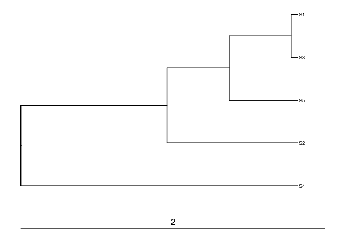
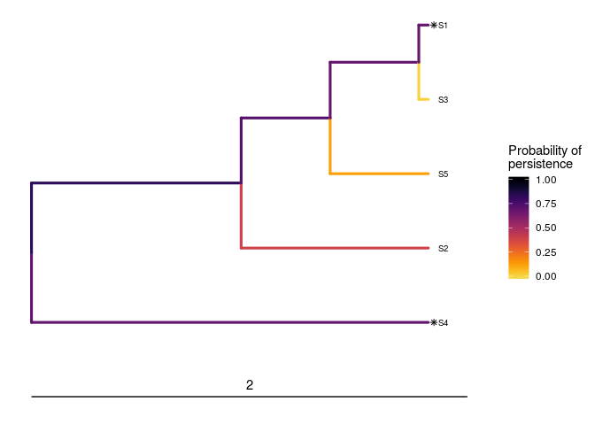

<!--- README.md is generated from README.Rmd. Please edit that file -->
Optimal Project Prioritization Protocol
=======================================

[](https://www.tidyverse.org/lifecycle/#maturing) [](https://travis-ci.org/prioritizr/optimalppp) [](https://ci.appveyor.com/project/jeffreyhanson/optimalppp) [](https://codecov.io/github/prioritizr/optimalppp?branch=master) [](https://CRAN.R-project.org/package=optimalppp)

The *optimalppp R* package provides methods for prioritizing funding of conservation projects using the 'Protect Prioritization Protocol'. A range of methods are provided for identifying priority projects for funding. These include exact algorithm solvers which can identify optimal solutions, and also stingy heuristic algorithms that have conventionally been used to identify solutions. This package also provides the functionality to visualize how well solutions maintain biodiversity.

Installation
------------

The latest development version can be installed using the following code. Please note that you will need install the *ggtree* package from Bioconductor since it is not available on [The Comprehensive R Archive Network](https://cran.r-project.org/).

``` r
if (!require(devtools))
  install.packages("devtools")
devtools::install_github("prioritizr/optimalppp")
if (!require(ggtree))
  devtools::install_bioc("ggtree")
```

Usage
-----

Here we will provide a short example showing how the *optimalppp R* package can be used to prioritize funding for conservation projects. To start off, we will set the seed for the random number generator to ensure you get the same results as shown here, set some default behavior for the *R* session, load the *optimalppp R* package, and load the *ggtree R* package to plot phylogenetic trees.

``` r
set.seed(500)
library(optimalppp)
library(ggtree)
```

Now we will load some data sets that are distributed with the package. First, we will load the `sim_tree` object. This object describes the evolutionary relationships between 5 simulated species (named S1, S2, S3, ..., S5). The length of each phylogenetic branch corresponds to millions of years of evolutionary history, and the last common ancestor for all these species occurred approximately 2 million years ago.

``` r
# load data
data(sim_tree)

# plot tree
ggtree(sim_tree) +
geom_tiplab(size = 2.5) +
geom_treescale(width = 2, x = 0, offset = 0.1)
```



Next, we will load the `sim_project_data` object. This object stores information about various conservation projects in a tabular format (i.e. `tibble`). Each row corresponds to a different project, and each column describes various properties associated with the projects. Importantly, the `"name"` column contains the name of each project, the `"cost"` column contains the cost of each project, the `"success"` column denotes the probability of each project succeeding if it is funded, and the `"S1"`--`"SN"` columns show the enhanced probability of each species persisting if the project is funded. It also contains additional columns for customizing the solutions, but we will ignore them for now. Note that the last project---the `"baseline_project"`---has a zero cost and represents the baseline probability of each species persisting if no other project is funded. Finally, though most projects in this example directly relate to a single species, you can input projects that directly affect the persistence of multiple species.

``` r
# load data
data(sim_project_data)

# print table
head(as.data.frame(sim_project_data))
```

    ##               name      cost   success locked_in locked_out        S1
    ## 1       S1_project  94.39929 0.8470486     FALSE      FALSE 0.8022048
    ## 2       S2_project 100.99137 0.9694998     FALSE      FALSE 0.0000000
    ## 3       S3_project 103.22583 0.7323494     FALSE       TRUE 0.0000000
    ## 4       S4_project  99.24274 0.9792034     FALSE      FALSE 0.0000000
    ## 5       S5_project  99.90791 0.7142838      TRUE      FALSE 0.0000000
    ## 6 baseline_project   0.00000 1.0000000     FALSE      FALSE 0.2933155
    ##          S2         S3        S4        S5
    ## 1 0.0000000 0.00000000 0.0000000 0.0000000
    ## 2 0.8079388 0.00000000 0.0000000 0.0000000
    ## 3 0.0000000 0.67841372 0.0000000 0.0000000
    ## 4 0.0000000 0.00000000 0.7034556 0.0000000
    ## 5 0.0000000 0.00000000 0.0000000 0.6569473
    ## 6 0.3883986 0.01203652 0.1952440 0.1237303

Let us assume that our resources are limited such that we can only spend, at most, $200 on funding conservation projects. In other words, our budget is capped at $200. Now, given the project data (`sim_project_data`), the species' evolutionary relationships (`sim_tree`), and this budget (`200`), So, let's cut to the chase and find an optimal solution.

``` r
# solve problem
s1 <- ppp_exact_solution(x = sim_project_data, tree = sim_tree,
                         budget = 200, project_column_name = "name",
                         cost_column_name = "cost",
                         success_column_name = "success")

# print solution
head(as.data.frame(s1))
```

    ##   solution objective budget    cost optimal method S1_project S2_project
    ## 1        1  3.045741    200 193.642    TRUE  exact       TRUE      FALSE
    ##   S3_project S4_project S5_project baseline_project
    ## 1      FALSE       TRUE      FALSE             TRUE

The object `s1` contains the solution and also various statistics associated with the solution in a tabular format (i.e. `tibble`). Here, each row corresponds to a different solution. Specifically, the `"solution"` column contains an identifier for the solution (this is useful for methods that output multiple solutions), the `"objective"` column contains the objective value (i.e. the expected phylogenetic diversity, Faith 2008), the `"budget"` column stores the budget used for generating the solution, the `"cost"` column stores the cost of the solution, the `"optimal"` column indicates if the solution is known to be optimal (`NA` values mean the optimality is unknown), and the `"method"` column contains the name of the method used to generate the solution. The remaining columns (`"S1_project"`, `"S2_project"`, `"S3_project"`, ..., `"S50_project"`, and `"baseline_project"`) indicate if a given project was prioritized for funding in the solution or not.

Here, the objective value (in the `"objective"` column) denotes the amount of evolutionary history that is expected to persist (i.e. 3.046 million years). Put simply, solutions that are expected to result in better conservation outcomes will be associated with a greater objective value. Since tabular data can be difficult to intuit, let's visualize how well this solution would maintain the different branches in the phylogeny. Note that species which receive any funding are denoted with an asterisk.

``` r
# visualize solution
ppp_plot(sim_project_data, sim_tree, s1, project_column_name = "name",
         cost_column_name = "cost", success_column_name = "success") +
geom_treescale(width = 2, x = 0, offset = 0.1)
```



This has just been a taster of the *optimalppp R* package. For more information, see the [package vignette](https://prioritizr.github.io/optimalppp/articles/optimalppp.html).

Citation
--------

Please use the following citation to cite the *optimalppp R* package in publications:

Hanson JO, Schuster R, Strimas-Mackey M, Bennett J, (2018). optimalppp: Optimal Project Prioritization Protocol. R package version 0.0.0.2. Available at <https://github.com/prioritizr/optimalppp>.
